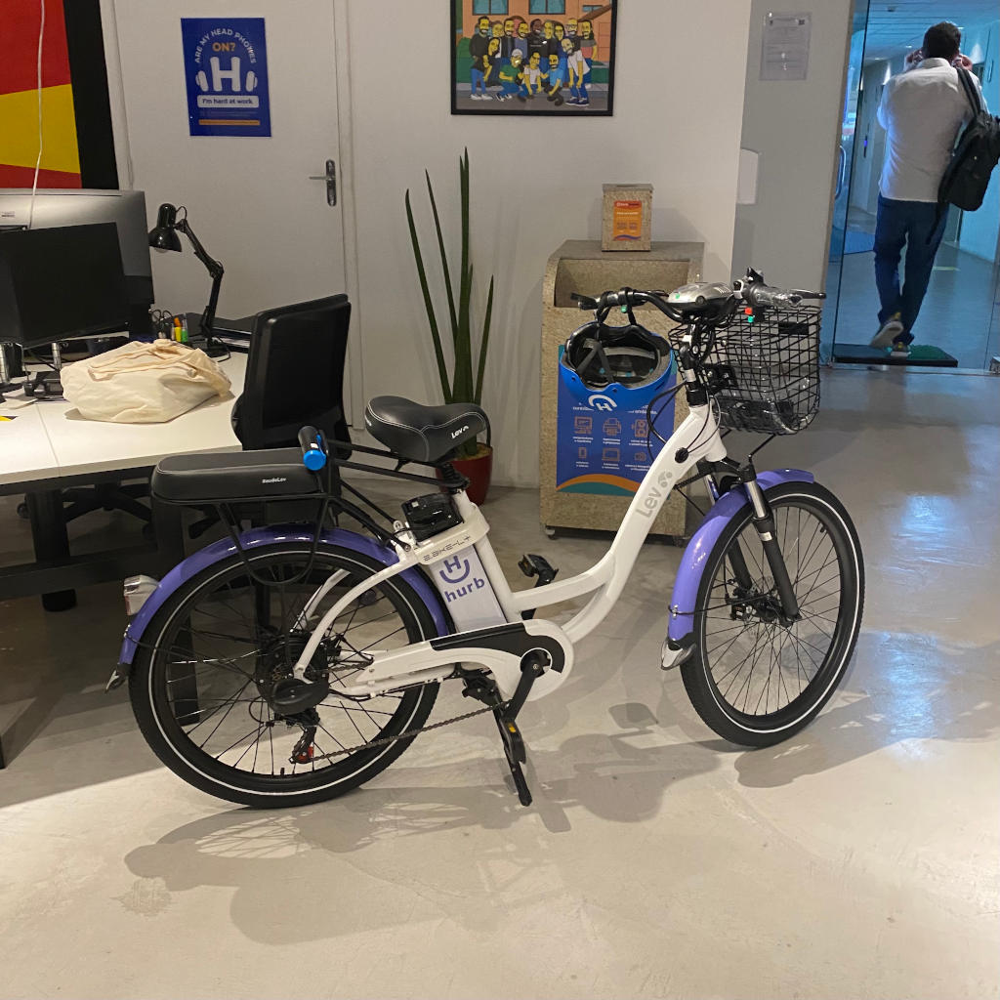

#  Sierra Challenge

[[English](README.md) | [Português](README.pt.md)]

Build a _smart contract_ to create a decentralized application (dapp) so we can rent Hurb's shared bike!

 

The fictitious dapp user will reserve Hurb's bike by hour, every 1 hour will be 42 HRB token. As a guarantee to rent a bike, the user will need to deposit 4 times the value of the tokens needed for the rental in a new _escrow_ account.

When the bicycle is returned, the rental amount in the _escrow_ account will be transferred to Hurb's wallet and the extra amount will be returned to the user's account. If the bicycle is not delivered, the amount in the _escrow_ account will be fully transfered to Hurb's wallet.

> Example: 3 hours rent will require 504 HRBs on deposit. When returned, the user will have 378 HRBs returned to it's wallet.

User will use ETH to buy HRB. The current value is 1 ETH to 6626070 HRB tokens.

The Hurb's wallet is `0x80210180b22ac1762df30Bd0dD6810D3aF8C798a`

## Requirements

-   Fork this challenge and create your project (or workspace) using your version of that repository, as soon as you _end_ the challenge, submit a _pull request_.
-   If you have any reason not to submit a _pull request_, create a private repository on Github, do every challenge on the **main** branch and don't forget to fill in the `pull-request.txt` file. As soon as you finish your development, add the user `automator-hurb` to your repository as a contributor and make it available for at least 30 days. **Do not add the `automator-hurb` until development is complete.**
-   If you have any problem creating the private repository, at the end of the challenge fill in the file called `pull-request.txt`, compress the project folder - including the `.git` folder - and send it to us by email.
-   Explain in the README how to implement and use the _smart contract_.
-   The _smart contract_ must work on a private Ethereum network or on Ropsten.
-   You must submit code tests in Solidity or Javascript as well

## Evaluation criteria

-   **Organization of code**: Separation of modules, folders, etc...
-   **Clarity**: Does the README explain briefly what the problem is and how can I run the application?
-   **Assertiveness**: Is the application doing what is expected? If something is missing, does the README explain why?
-   **Code readability** (including comments)
-   **Security**: Are there any clear vulnerabilities?
-   **Test coverage** (We don't expect full coverage)
-   **History of commits** (structure and quality)
-   **Technical choices**: Is the choice of components, patterns, architecture, etc. the best choice for _smart contract_?

Bonus: Extra points for those who create a process to transfer the rented bicycle to someone else, with the extra value going back to the original person.

## Questions

Any questions you may have, check the [_issues_](https://github.com/HurbCom/challenge-sierra/issues) to see if someone hasn't already and if you can't find your answer, open one yourself. new issue!

Good luck and good trip! ;)

 

